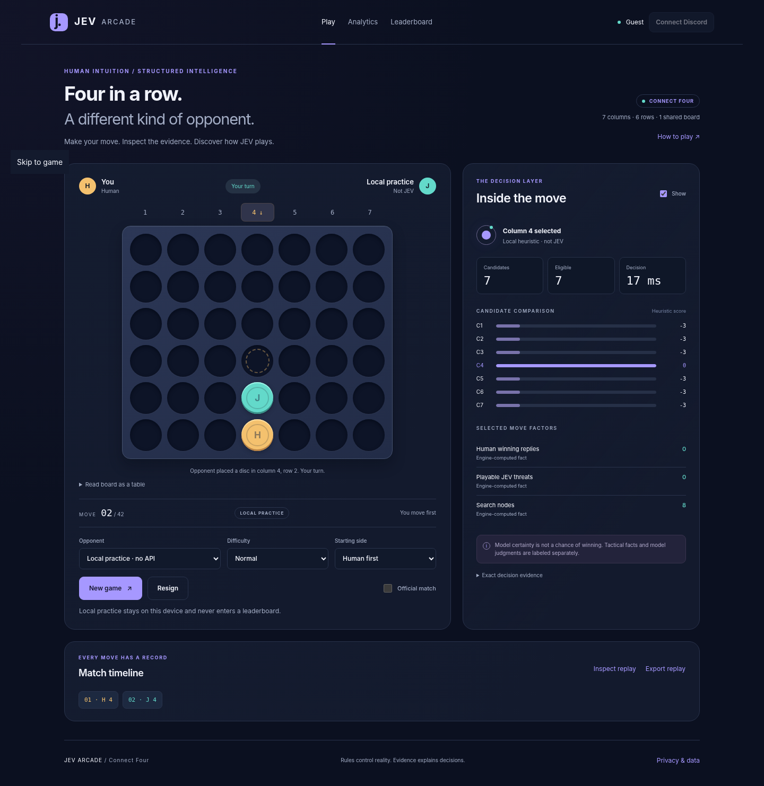

<p align="center"></p>

# Connect Four vs JEV

A playable, framework-free Connect Four application with a server-side JEV adapter, Discord identity and launch context, authoritative matches, community leaderboards, and detailed research analytics.

**Local practice works immediately without API keys or an npm install.** Live JEV and Discord features are implemented but require your credentials and application configuration. No live external integration or Cloudflare deployment was exercised while assembling this package. See [verification](docs/VERIFICATION.md).



## Run locally

Install Node.js **22.16 or newer**, extract this directory, then run:

```sh
npm start
```

Open **http://localhost:8787**. On Windows, `start-local.bat` runs the same command. Choose **Local practice** and start a game. Native SQLite creates `.data/game.sqlite`; the local server generates a local-only secret when none is supplied. Node 22 may print its experimental SQLite warning.

This server binds to loopback, not a public interface. Use the documented Worker deployment for public hosting. Opening `index.html` directly from the filesystem is not supported because ES modules and Workers need an HTTP origin.

### Enable actual JEV

Copy `.env.example` to `.env`, set `TYPESAFE_API_KEY`, keep or deliberately change the pinned `JEV_MODEL`, and restart. The page then permits **JEV · server verified** games. All model requests go through the backend; the key never goes to the browser.

```sh
# Windows PowerShell: Copy-Item .env.example .env
cp .env.example .env
npm start
```

Set Discord credentials only after configuring the redirect URI and application. Guest JEV play does not require Discord. Ranked play does. The local heuristic is never represented as a model call or silently used to finish a ranked match.

### Ranked match

**Ranked match** (beside New game) puts a game on the leaderboard. It is available only to a Discord-signed-in player using the **JEV** opponent on a server that has both configured; the server enforces the same rules whatever the page shows. The page always says why the box is unavailable and what to do next:

| Situation | Guidance shown |
|---|---|
| Server has no `TYPESAFE_API_KEY` | Unavailable: the operator must add the key. Only local practice runs. |
| Opponent is Local practice | Ranked needs JEV and a Discord account; **Switch to JEV** button. |
| JEV, guest, Discord configured | Needs a Discord account; **Connect Discord** button. |
| JEV, guest, Discord not configured | Unavailable: the operator must configure Discord. Unranked JEV practice works. |
| JEV, signed in | Tick the box before **New game**; the rules (server-assigned side, no undo, 24-hour deadline, resignation is a loss) are shown. |

The box stays keyboard-focusable while unavailable (`aria-disabled`), its reason is its accessible description, and trying to tick it announces the reason. The page never starts a ranked match on its own: the automatic first game on page load is always unranked, so a ranked game needs an explicit tick and New game. Sign-in, sign-out, mode changes, returning to the tab and restoring a cached page all refresh the box; a refresh that is due while a game request is still pending waits until it settles (it never resends the game request). Identity requests never overlap: a request without a session cookie makes the server create a guest session with its own `Set-Cookie` and CSRF token, so two at once could leave the browser with one session's cookie and the page with the other's token. A refresh asked for while one is in flight is sent after it (several share one trailing request), and startup (mode choice, resuming an active server match, redeeming a launch ticket) waits for the newest answer, so a tab return during page load cannot leave the page in local practice, send a ticket without its CSRF token, or start a game the server rejects with `CSRF_REJECTED`. The reason and its button stay visible wherever the box is visible, including short landscape screens; only the picture-in-picture frame hides the box and its guidance together.

## Included

| Area | Implemented behavior |
|---|---|
| Game | Classic 7 × 6 rules, immutable transitions, gravity, all winning directions, draws, keyboard/touch input, responsive layout and reduced motion |
| Opponents | Four difficulty profiles, bounded tactical proofs, typed candidate Score questions, pinned model version, response validation, deterministic tie-breaking and an explicit local alternative |
| Identity | Minimal-scope Discord OAuth, session rotation, signed interaction verification, opaque single-use launch tickets bound to the invoking user |
| Results | Authoritative accepted moves, write-ahead decision evidence, idempotency, compare-and-swap writes, replay/provenance verification, disclosed resignations and deadlines |
| Leaderboards | World, Server and Channel scopes; fixed opponent-version, difficulty and starting-side cohorts; provisional samples and stable pagination |
| Analytics | Outcomes, tactical opportunities, candidate and question evidence, probability distributions, model certainty, search work, latency quantiles, failure/retry reasons, token and estimated cost accounting, heatmaps and opt-in client measurements |
| Audit and research | JSON/NDJSON/eight CSV tables, independent offline audit command, HTML report generator, seeded paired benchmarks, bounded endgame oracle and explicit evidence-retention status |

The browser and application backend have **zero runtime npm dependencies**. Playwright and Wrangler are development/deployment tools only.

## Analytics

The **Analytics** tab presents a current-match or recent-history dashboard. It includes column distributions, placement heatmaps, immediate-win conversion, missed wins, avoidable immediate losses, block rates, model/search reliability, usage, latency, and separate comparison cohorts.

Every remote decision stores its prepared request before inference. Completed evidence includes the actual bounded features, candidates, pruning reasons, typed answer distributions, utilities, selected column, request/response hashes, HTTP attempts, and timings. The operator view adds aggregate daily starts, completions, interruptions, status counts, and request-error counters without returning player identities.

The exports distinguish **official results**, **practice**, **tactical bypasses**, **model output**, and **client-reported measurements**. Missing observations remain null rather than becoming invented zeroes. Model confidence is not a probability of winning.

Read the [analytics dictionary](docs/ANALYTICS.md) for definitions, denominators, caps, privacy, coverage and interpretation limits.

## Tests and tools

```sh
npm test
npm run test:coverage
npm run audit -- examples/mock-provider-match-audit.json
npm run report -- examples/mock-provider-match-audit.json --out analytics-report
npm run bench -- --pairs 10 --policy local --opponent random --out bench/output
```

The included audit fixture uses **mocked provider responses**, not live JEV. The included benchmark is **local versus seeded random**, not a JEV strength claim.

For browser tests or deployment tooling:

```sh
npm install
npx playwright install chromium
npm run test:browser
```

Dependency installation was unavailable in the assembly environment. The two direct development dependencies are pinned, but no generated lockfile is included. Generate and review a lockfile in your environment before using `npm ci` in a controlled release pipeline. Local play, native tests, offline audit, reports and local benchmarks do not require those development packages.

## Documentation

- [Architecture and trust boundaries](docs/ARCHITECTURE.md)
- [Analytics and event dictionary](docs/ANALYTICS.md)
- [API reference](docs/API.md)
- [Local and Cloudflare/Discord deployment](docs/DEPLOYMENT.md)
- [Security, privacy and limitations](docs/SECURITY.md)
- [Executed verification and remaining gates](docs/VERIFICATION.md)
- [Benchmark protocol](bench/README.md)
- [Official documentation references](docs/SOURCES.md)

## Repository map

```text
public/       Vanilla page, styling, controller, shared rules/policy/analytics
server/       Worker routes, auth, JEV adapter, matches, audit, leaderboards
migrations/   D1/SQLite schema
scripts/      Local server, Discord registration, offline audit and report
bench/        Seeded paired runner and bounded reference endgame solver
tests/        Native engine, policy, provider, auth, security and browser tests
docs/         Setup, metric dictionary, architecture, evidence and previews
examples/     Clearly labeled mock audit/report and actual offline benchmark
```

## Before a public launch

Configure real secrets and D1, complete Discord application setup, verify a live JEV response against the pinned schema, smoke-test a genuine Discord launch and ranked match, review hosting CPU/cost limits, and establish backups and operational alerting. Do not treat the included local verification as an independent security audit or live-service certification.
