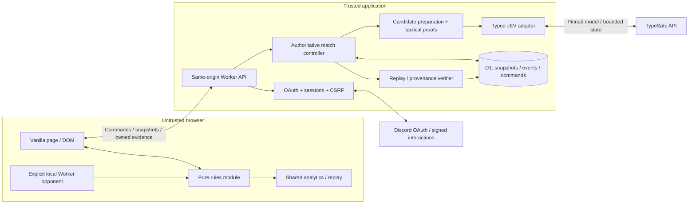
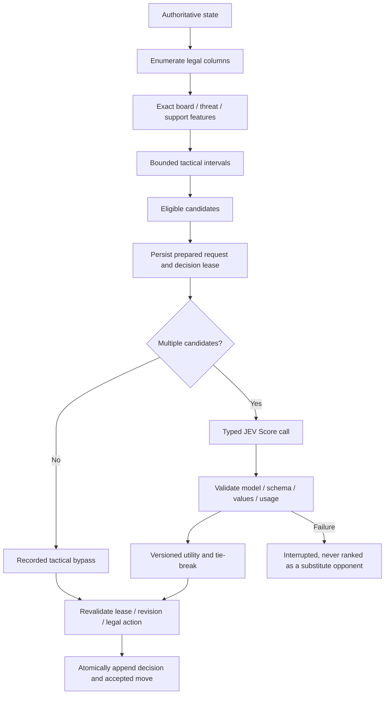
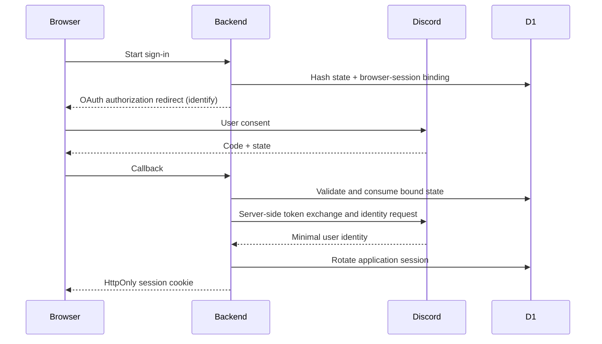
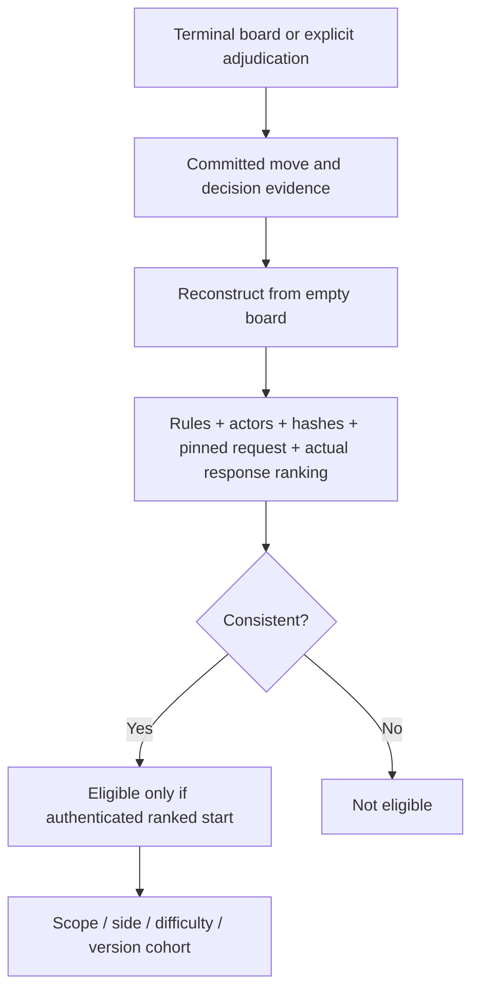

# Architecture

## Runtime and trust boundary

No browser framework, ORM, game engine, WebSocket server or general-purpose public AI proxy is required. Rules and analytics run unchanged in browser, tests, backend and CLI. Local development executes the actual Worker handler against a native SQLite D1-shaped adapter, not a separate mock application server.

## Rules

The state has 42 bottom-row-first cells, ply, toMove, terminal status, winner, winning cells and last move. An action is only `{type:'drop',column:0..6}`. It cannot specify a row, board or score. Apply transitions immutably, detect wins before a final-cell draw, and reject post-terminal moves. Structural deserialization is not accepted as proof of a legally reached official game; replay from the empty board supplies that check.

## Opponent profiles

| Profile | Search support including root ply | Nodes per candidate | Factors and weights |
|---|---:|---:|---|
| Easy | 1 | 50 | position 1 |
| Normal | 2 | 100 | attack .5, safety .5 |
| Hard | 4 | 2,000 | attack .4, safety .4, support .2 |
| JEV | 6 | 10,000 | attack .35, safety .35, support .2, initiative .1 |

These are implemented settings, not measured difficulty rankings. The maximum is 28 Score questions, seven columns times four factors. A singleton candidate bypasses the model with a recorded tactical reason. Utilities are rounded before deterministic tie-breaking. Unknown bounded-search positions never become false draws.

The normalized model state contains no account or community identity. TypeSafe does not need user names, Discord IDs, credentials or arbitrary chat text to assess a board.

## Atomic writes and concurrent commands

A match snapshot and its associated event batch advance with compare-and-swap against the current version. A unique write nonce guards dependent inserts, because a zero-row SQL update does not automatically make a transaction fail. Accepted command keys and hashes prevent duplicate moves and detect reuse with a different body.

The human move commits before asynchronous inference. The prepared decision and lease then commit before the provider call. The result may commit only against the same pending lease and current revision. Duplicate browser retries return accepted state rather than sending another inference. A process-lost decision expires into an interruption, rather than silently sampling a replacement answer. This deliberately favors auditability over transparent crash recovery.

## Authentication and community launch

The `/play` interaction proves an invocation in a guild text channel only after Ed25519 signature, timestamp, application, guild-install and member checks. Its ephemeral launch link carries a random single-use fragment ticket, not editable guild claims. A pre-login browser may stage that ticket. Redemption after login requires the exact invoking Discord account. Proof expires ten minutes after invocation. Membership or permission revocation is not continuously monitored.

No message-reading scopes, email scope, gateway connection or always-connected bot process are used. The registration script adds/updates `/play` without bulk-replacing unrelated application commands.

## Verification and leaderboards

Official outcomes remain server-owned. Local replays and user uploads cannot become official results. Starting side is server-assigned for ranked games; the two starting-side cohorts remain separate. Ranked games permit no undo and have a disclosed 24-hour completion deadline. External human solver assistance cannot be prevented by this system.

## Persistence

The nine tables are `users`, `sessions`, `tickets`, `context_grants`, `matches`, `events`, `commands`, `client_metrics`, and `counters`. The extra event/command/metric tables are justified by detailed diagnostics and concurrency requirements. `matches` owns final results; leaderboard views aggregate directly rather than duplicating entries.

The SQL migration is the schema of record. Foreign keys cascade account deletion. Partial unique indexes prevent more than one active ranked match per account. Discord snowflakes remain strings.

## Scope deliberately excluded

No full-game perfect solver, hidden-reasoning display, Elo rating, live streaming, forced public replay sharing, cash-prize anti-cheat claim, centralized external analytics tracker or generalized multi-game plugin framework is included. Future games can reuse auth, persistence patterns, transport and event/report structures without turning this game into a framework first.
